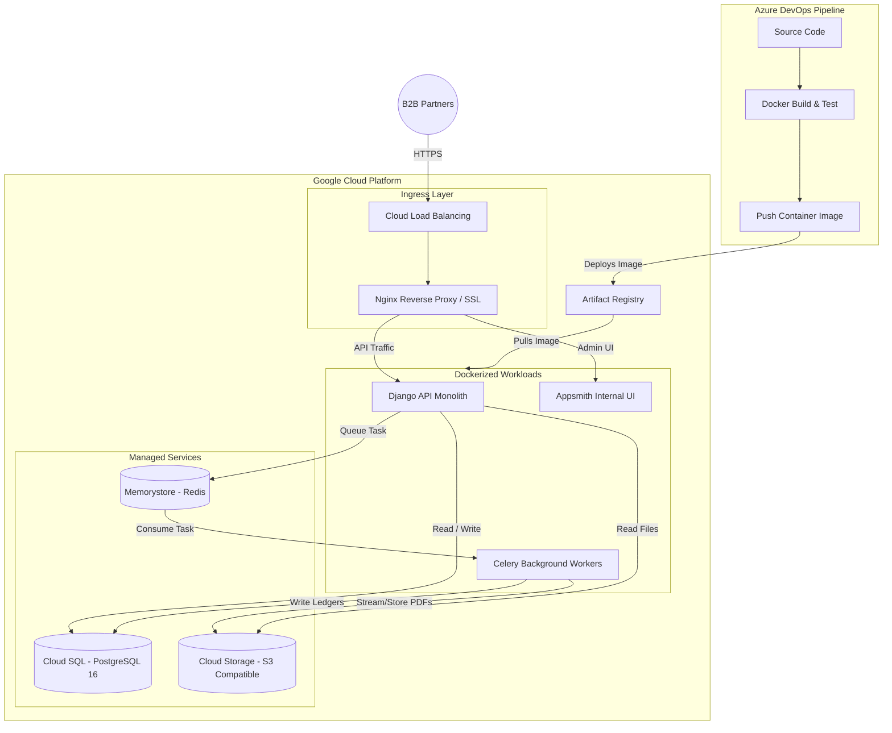
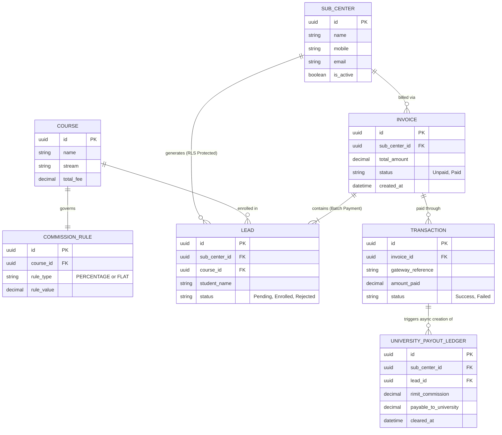
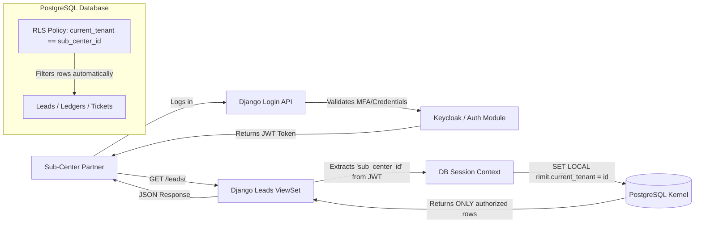

Here is the consolidated **Application Context & Master Project Blueprint** for the RIMIT Education B2B Aggregator. This serves as the single source of truth detailing what the application is, how it operates, and the technical boundaries defining its construction.

---

# Application Context: RIMIT B2B Aggregator & ERP Portal

## 1. Core Identity & Business Purpose

The application is a cloud-based Business-to-Business (B2B) Educational Portal and Centralized Admission Management System designed for RIMIT Education and SPES Education. It serves a dual purpose:

1. **National University Aggregator:** A unified digital directory for sub-centers to search and filter university courses, dynamic fee structures, eligibility criteria, and digital prospectuses across India.

2. **Franchise ERP & Clearinghouse:** An operational dashboard for regional franchise partners (sub-centers) to manage student leads, submit admission documents, raise support tickets, access marketing tools, and process bulk financial settlements.

## 2. The Operational Model (B2B Clearinghouse)

The system operates on an "Escrow/Batch Payment" financial model:

* **Lead Capture:** Sub-centers act as separate business entities, capturing student leads and documents through a secure, isolated dashboard.
* **Financial Flow:** Sub-centers collect cash directly from students. They then use the application to select multiple pending students and execute a **Batch Checkout** via a payment gateway.
* **Automated Commissions:** Upon successful payment, a background worker calculates RIMIT's commission (either a flat rate or percentage) and logs the remaining balance in a Double-Entry PostgreSQL ledger as payable to the respective university.
* **Out of Scope:** Automated bank payouts to universities and automated refunds are explicitly excluded. RIMIT handles these manually using the system's ledger reports.

## 3. Technical Stack & Architecture

The system follows a **Minimalist Engineering Protocol**, prioritizing out-of-the-box framework capabilities over custom code to ensure high-velocity delivery.

* **Infrastructure:** Deployed via Docker containers (GCP/AWS) with an Nginx reverse proxy handling ingress, SSL termination, and security headers.
* **Backend (Core Logic):** A monolithic **Django (Python)** API utilizing Django REST Framework (DRF).
* **Database (State & Security):** **PostgreSQL 16**. It acts as the ultimate security enforcer using **Row-Level Security (RLS)** to guarantee multi-tenant data isolation. It also replaces external search engines by using native `tsvector` and `GIN` indexing for course searches.
* **Frontend (UI/UX):** **Appsmith** (Low-Code platform). All sub-center and administrative dashboards are built using drag-and-drop Appsmith components bound securely to the Django APIs via JWT authentication.
* **Asynchronous Processing:** **Celery & Redis** handle all heavy background tasks, including bulk PDF receipt generation, ledger math, and streaming 10MB+ files to AWS S3/Cloud Storage.

## 4. Key Functional Modules

1. **Centralized Aggregator Hub:** Visual grid interface for courses, searchable by stream, eligibility, and fees, backed by a digital vault for prospectuses.

2. **Sub-Center Dashboard (ERP):** A left-sidebar navigation portal featuring:
* **Universal Lead Generator:** Forms capturing detailed demographic and academic data.

* **Accounts & Financials:** Center-wise ledger balances, automated invoicing, and a bulk download center for receipts.

* **Marketing Tools:** Access to pre-approved landing pages, WhatsApp API triggers, and downloadable brochures/assets.

* **Helpdesk Tickets:** An internal multi-level escalation matrix for operational queries.

3. **Session Enforcement Matrix:** A programmatic rules engine that validates student eligibility against specific university intake cycles before allowing an admission to proceed.

## 5. Development & Delivery Governance

* **Discovery Phase:** Strictly time-boxed to 3 weeks to lock the database schema and UI wireframes.
* **Revision Limits:** UI modifications are mathematically capped at two rounds per module to prevent design churn.
* **Sign-Off Protocol:** All approvals are asynchronously tracked in Azure DevOps; unapproved deviations trigger paid Change Requests (CRs).
* **MFA Strategy:** Time-based One-Time Passwords (TOTP/Authenticator apps) act as the primary security layer to reduce SMS/telecom OPEX, with SMS acting only as a fallback.

Here are the critical systems and architecture diagrams for the RIMIT B2B Aggregator.

To align with standard enterprise practices, I have mapped the infrastructure diagram specifically for a **Google Cloud Platform (GCP)** deployment using **Docker** containers, orchestrated via **Azure DevOps** pipelines. I have also included the core **Entity Relationship Diagram (ERD)** for the PostgreSQL database to visualize the financial ledger logic.

### 1. Cloud Infrastructure & CI/CD System Architecture

This diagram outlines the physical deployment strategy. It shows how code moves from your Azure DevOps pipelines into Docker containers running on GCP, utilizing Cloud SQL for the PostgreSQL database and Cloud Storage for the document vault.

### 2. Core Entity Relationship Diagram (ERD): Database & Ledger

This diagram represents the PostgreSQL schema design required to support the new "Batch Checkout" escrow model and the Row-Level Security (RLS) requirements. It visually connects the Sub-Centers to their generated Leads, Invoices, and automated Commissions.

### 3. Application Security & RLS Context Flow

This focused diagram explains exactly how Row-Level Security (RLS) works in practice, ensuring that a sub-center partner can absolutely never access another center's data, regardless of API flaws.

