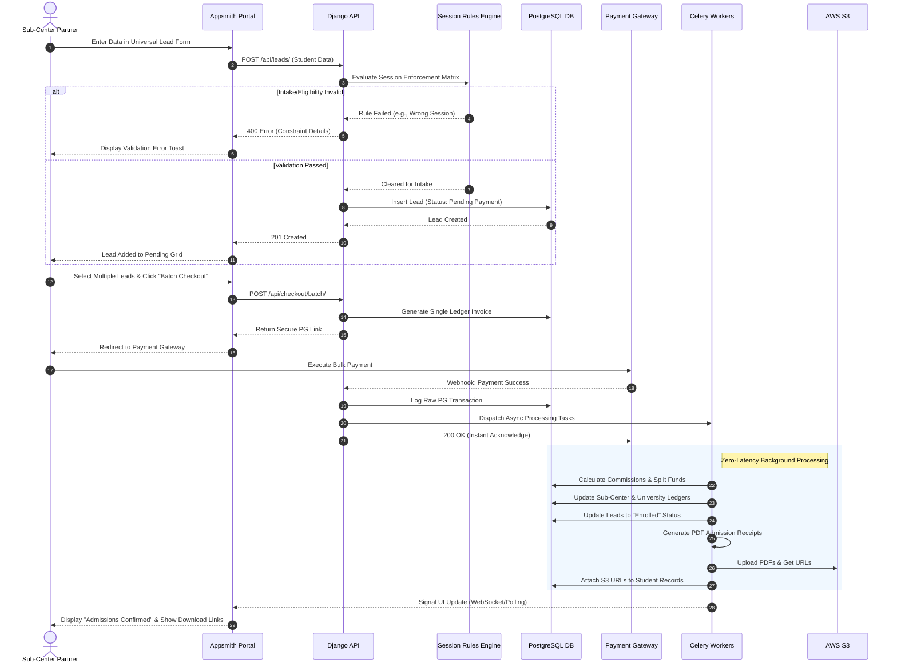
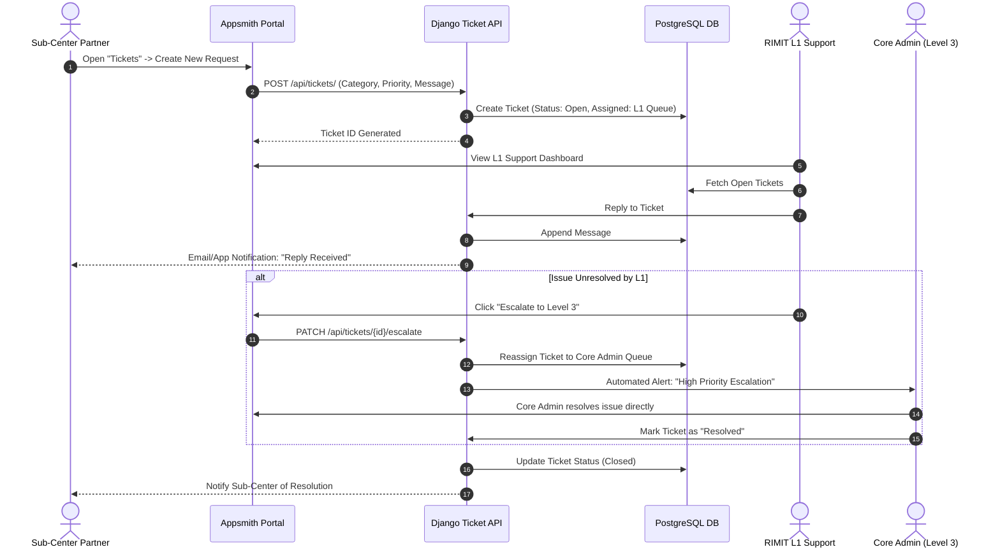
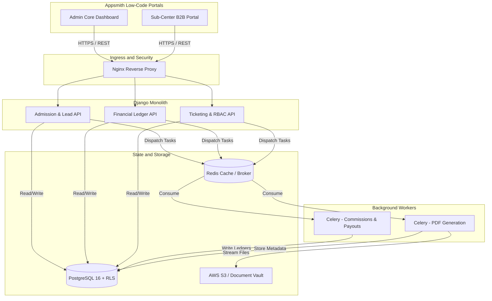

Here is the definitive guide to the workflows and business rules for the RIMIT Education B2B Aggregator. This document translates the operational requirements into strict logic constraints for your engineering team.

---

## I. Detailed Operational Workflows

### 1. Lead Capture & Intake Validation Workflow

This flow governs how a Sub-Center (SC) inputs student data and how the system validates it before allowing financial transactions.

1. **Initiation:** SC logs into the Appsmith portal via MFA (TOTP primary, SMS fallback).
2. **Data Entry:** SC opens the Universal Lead Generator and inputs demographic and academic details (Course, Sub-Course, DOB, State, District).
3. **Submission & Handoff:** The Appsmith UI POSTs the payload to the Django API.
4. **Rule Evaluation (The Gatekeeper):** The Django backend passes the payload through the **Session Enforcement Matrix**.
* *Condition A (Fail):* If the student’s profile does not match the strict intake rules for the selected university/session, the API returns a `400 Bad Request` with exact constraint details. The UI displays a red error toast.
* *Condition B (Pass):* If valid, the database creates a new Lead record with the status `Pending Payment`.

5. **Completion:** The UI refreshes the "Pending Payments" grid to reflect the new valid lead.

### 2. Batch Checkout & Escrow Workflow

This is the core financial engine of the application, utilizing a shopping-cart model to minimize payment gateway fees.

1. **Selection:** SC navigates to the Accounts module and selects multiple students from the "Pending Payments" grid.
2. **Invoice Generation:** SC clicks "Batch Checkout." The API generates a single, consolidated invoice in the PostgreSQL `invoices` table.
3. **Gateway Handoff:** The API returns a secure payment link. SC executes the bulk payment via the integrated Payment Gateway (PG).
4. **Webhook Acknowledgment:** The PG sends a success webhook to the Django monolith. Django logs the raw transaction and immediately returns a `200 OK` to the PG to prevent timeouts.
5. **Asynchronous Settlement (Celery):**
* Celery picks up the transaction ID.
* It queries the `commission_rules` table to calculate RIMIT’s cut (percentage or flat fee) for each specific course in the batch.
* It updates the `university_payout_ledgers` with the exact remaining balance owed to the university.
* It updates all associated student records to `Enrolled` status.
* It generates the official PDF admission receipts and streams them to the S3 Document Vault.

### 3. Support Ticketing & Escalation Workflow

This workflow protects the RIMIT core administrative team from direct SC spam while ensuring SLA compliance.

1. **Ticket Creation:** SC opens the Helpdesk module and submits a ticket (Technical, Operational, or Admission Query).
2. **L1 Assignment:** The database creates the ticket with an `Open` status, mapped exclusively to the RIMIT Level 1 Support queue.
3. **L1 Resolution Attempt:** L1 support communicates with the SC via the ticket thread. If resolved, L1 marks the ticket `Closed`.
4. **Escalation Trigger:** If L1 cannot resolve the issue, they click "Escalate." The API patches the ticket, moving it to the Level 2/Level 3 queue.
5. **Core Admin Action:** Level 3 (Core Admin) receives an automated alert, resolves the issue directly within the system, and closes the ticket.

### 4. Asynchronous Bulk Document Download Workflow

This ensures the Django API does not crash due to memory exhaustion when sub-centers request hundreds of receipts.

1. **Request:** SC requests a bulk download of receipts or marketing assets for a specific date range.
2. **Queuing:** Django accepts the request, triggers a Celery task, and immediately returns a `202 Accepted` response to the UI ("Preparing download...").
3. **Processing:** Celery fetches the individual PDF files from S3, streams them to the local container disk, and compresses them into a single `.zip` archive.
4. **Delivery:** Celery uploads the `.zip` back to a temporary S3 bucket, generates a pre-signed URL, and triggers an in-app notification in the SC's dashboard containing the secure download link.

---

## II. Master Business Rules & Constraints

### 1. Security & Data Isolation Rules

* **Row-Level Security (RLS) Mandate:** Multi-tenancy is strictly enforced at the PostgreSQL kernel level. A Sub-Center’s JWT token dictates their database context; it is structurally impossible for them to query, view, or modify leads, tickets, or ledgers belonging to another franchise.
* **Zero-Trust API Routing:** Every DRF ViewSet must explicitly re-verify the `sub_center_id` extracted from the Auth token before executing any mutation.
* **MFA Enforcement:** Access to the B2B portal requires mandatory Multi-Factor Authentication.

### 2. Session Enforcement Matrix (Intake Rules)

* **Strict Cycle Mapping:** The system must reject admission attempts for sessions that are historically closed or for which the candidate lacks the prerequisite timeline eligibility (e.g., attempting to register a fresh candidate into a restricted October backlog session).
* **Admin Override:** Only users with the `Super Admin` or `Academic Head` role can bypass the Session Enforcement Matrix via a logged, audited override action.

### 3. Financial & Ledger Rules

* **Double-Entry Immutable Ledger:** Financial states are never managed by simple boolean flags (e.g., `is_paid = True`). Every cent must be traceable through the `transactions`, `center_ledgers`, and `university_payout_ledgers` tables.
* **Commission Engine Logic:** RIMIT's commissions are dictated dynamically by the `commission_rules` table (Flat Fee or Percentage). Hardcoding commission math inside the Django views is strictly prohibited.
* **Out-of-Scope Payouts:** The system functions purely as a tracking ledger. Automated API-based bank payouts to universities and automated refund routing are expressly excluded. Finance teams will execute manual RTGS/NEFT transfers based on generated ledger reports.

### 4. UI/UX Interaction Rules

* **Zero-Custom CSS (Appsmith):** The frontend relies entirely on native Appsmith widgets and global theme configurations to ensure high-velocity delivery. No bespoke HTML/CSS injection is permitted unless functionally critical.
* **Optimistic UI Prevention:** Submit buttons (e.g., "Pay Now", "Add Lead") must bind their `Disabled` state to the API query's execution state to mathematically prevent double-submissions.
* **Server-Side Pagination:** Data tables (Leads, Ledgers) must never load full datasets into the client browser. Pagination (`?page=X&limit=Y`) is mandatory for all list views.

Here is a highly detailed, **End-to-End Admission Lifecycle** workflow diagram. This brings all the previous modules (Lead Capture, Rules Engine, Batch Payment, and Async Processing) together into a single, unified view representing the core business journey.

I have also included the workflow for the new **Helpdesk & Ticketing System** requested in the updated RFP.

### 1. End-to-End Student Admission & Escrow Lifecycle

This diagram illustrates the complete journey of a student from initial lead entry by the Sub-Center, through the automated eligibility validation, batch checkout, and asynchronous ledger updates.

### 2. Helpdesk & Escalation Ticketing Workflow

This diagram maps out how sub-centers request support. It demonstrates how Level 1, 2, and 3 escalations are handled securely inside the database without exposing direct contact details of RIMIT's core team to the public.

These diagrams are structured with standard Mermaid syntax and are ready to be embedded directly into your technical addendum, Azure DevOps wikis, or project documentation.

The error occurred because Mermaid.js requires brackets `[ ]` instead of quotation marks `" "` when adding custom labels to subgraphs. Additionally, using the `&` symbol in certain shorthand node connections can occasionally cause parsing issues in older markdown viewers.

Here is the corrected and highly compatible version of the **Technical Architecture & Task Allocation Map**. I have replaced the quotes with brackets and expanded the connection paths to ensure it renders flawlessly across all viewers (including Azure DevOps and GitHub).

